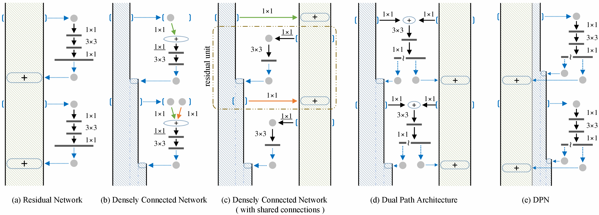

# Dual Path Networks
This repository contains the code and trained models of:

Yunpeng Chen, Jianan Li, Huaxin Xiao, Xiaojie Jin, Shuicheng Yan, Jiashi Feng. "Dual Path Networks" ([NIPS17](https://arxiv.org/abs/1707.01629)).



- DPNs helped us won the **1st place** in Object Localization Task in [ILSVRC 2017](http://image-net.org/challenges/LSVRC/2017/index), with all competition tasks within Top 3. (Team: [NUS-Qihoo_DPNs](http://image-net.org/challenges/LSVRC/2017/results))

## Implementation

DPNs are implemented by [MXNet \@92053bd](https://github.com/cypw/mxnet/tree/92053bd3e71f687b5315b8412a6ac65eb0cc32d5).

### Augmentation
| Method         |  Settings  |
| :------------- | :--------: |
| Random Mirror  |    True    |
| Random Crop    |  8% - 100% |
| Aspect Ratio   |  3/4 - 4/3 |
| Random HSL     | [20,40,50] |
> Note: 
> We did not use PCA Lighting and any other advanced augmentation methods.
> Input images are resized by bicubic interpolation.

### Normalization
The augmented input images are substrated by mean RGB = [ 124, 117, 104 ], and then multiplied by 0.0167.

### Mean-Max Pooling
Here, we introduce a new testing technique by using Mean-Max Pooling which can further improve the performance of a well trained CNN in the testing phase without the need of any training/fine-tuining process. This testing technique is designed for the case when the testing images is larger than training crops. The idea is to first convert a trained CNN model into a [convolutional network](http://www.cv-foundation.org/openaccess/content_cvpr_2015/papers/Long_Fully_Convolutional_Networks_2015_CVPR_paper.pdf) and then insert the following Mean-Max Pooling layer (a.k.a. [Max-Avg Pooling](https://arxiv.org/abs/1509.08985)), i.e. 0.5 * (global average pooling + global max pooling), just before the final softmax layer.

Based on our observations, Mean-Max Pooling consistently boost the testing accuracy. We adopted this testing strategy in both LSVRC16 and LSVRC17.


## Results

### ImageNet-1k

**Single Model, Single Crop Validation Error:**

<dl>
<table class="tg" style="undefined;table-layout: fixed; width: 739px">
<colgroup>
<col style="width: 103px">
<col style="width: 92px">
<col style="width: 87px">
<col style="width: 68px">
<col style="width: 72px">
<col style="width: 62px">
<col style="width: 72px">
<col style="width: 87px">
<col style="width: 96px">
</colgroup>
  <tr>
    <th class="tg-baqh" rowspan="2">Model</th>
    <th class="tg-baqh" rowspan="2">Size</th>
    <th class="tg-baqh" rowspan="2">GFLOPs</th>
    <th class="tg-baqh" colspan="2">224x224</th>
    <th class="tg-baqh" colspan="2">320x320</th>
    <th class="tg-baqh" colspan="2">320x320<br>( with mean-max pooling )</th>
  </tr>
  <tr>
    <td class="tg-baqh">Top 1</td>
    <td class="tg-baqh">Top 5</td>
    <td class="tg-baqh">Top 1</td>
    <td class="tg-baqh">Top 5</td>
    <td class="tg-baqh">Top 1</td>
    <td class="tg-baqh">Top 5</td>
  </tr>
  <tr>
    <td class="tg-baqh">DPN-68</td>
    <td class="tg-baqh">49 MB</td>
    <td class="tg-baqh">2.5</td>
    <td class="tg-baqh">23.57</td>
    <td class="tg-baqh">6.93</td>
    <td class="tg-baqh">22.15</td>
    <td class="tg-baqh">5.90</td>
    <td class="tg-baqh">21.51</td>
    <td class="tg-baqh">5.52</td>
  </tr>
  <tr>
    <td class="tg-baqh">DPN-92</td>
    <td class="tg-baqh">145 MB</td>
    <td class="tg-baqh">6.5</td>
    <td class="tg-baqh">20.73</td>
    <td class="tg-baqh">5.37</td>
    <td class="tg-baqh">19.34</td>
    <td class="tg-baqh">4.66</td>
    <td class="tg-baqh">19.04</td>
    <td class="tg-baqh">4.53</td>
  </tr>
  <tr>
    <td class="tg-baqh">DPN-98</td>
    <td class="tg-baqh">236 MB</td>
    <td class="tg-baqh">11.7</td>
    <td class="tg-baqh">20.15</td>
    <td class="tg-baqh">5.15</td>
    <td class="tg-baqh">18.94</td>
    <td class="tg-baqh">4.44</td>
    <td class="tg-baqh">18.72</td>
    <td class="tg-baqh">4.40</td>
  </tr>
  <tr>
    <td class="tg-baqh">DPN-131</td>
    <td class="tg-baqh">304 MB</td>
    <td class="tg-baqh">16.0</td>
    <td class="tg-baqh">19.93</td>
    <td class="tg-baqh">5.12</td>
    <td class="tg-baqh">18.62</td>
    <td class="tg-baqh">4.23</td>
    <td class="tg-baqh">18.55</td>
    <td class="tg-baqh">4.16</td>
  </tr>
</table>
</dl>

### ImageNet-1k (Pretrained on ImageNet-5k)

**Single Model, Single Crop Validation Error:**

<dl>
<table class="tg" style="undefined;table-layout: fixed; width: 739px">
<colgroup>
<col style="width: 103px">
<col style="width: 92px">
<col style="width: 87px">
<col style="width: 68px">
<col style="width: 72px">
<col style="width: 62px">
<col style="width: 72px">
<col style="width: 87px">
<col style="width: 96px">
</colgroup>
  <tr>
    <th class="tg-baqh" rowspan="2">Model</th>
    <th class="tg-baqh" rowspan="2">Size</th>
    <th class="tg-baqh" rowspan="2">GFLOPs</th>
    <th class="tg-baqh" colspan="2">224x224</th>
    <th class="tg-baqh" colspan="2">320x320</th>
    <th class="tg-baqh" colspan="2">320x320<br>( with mean-max pooling )</th>
  </tr>
  <tr>
    <td class="tg-baqh">Top 1</td>
    <td class="tg-baqh">Top 5</td>
    <td class="tg-baqh">Top 1</td>
    <td class="tg-baqh">Top 5</td>
    <td class="tg-baqh">Top 1</td>
    <td class="tg-baqh">Top 5</td>
  </tr>
  <tr>
    <td class="tg-baqh">DPN-68</td>
    <td class="tg-baqh">49 MB</td>
    <td class="tg-baqh">2.5</td>
    <td class="tg-baqh">22.45</td>
    <td class="tg-baqh">6.09</td>
    <td class="tg-baqh">20.92</td>
    <td class="tg-baqh">5.26</td>
    <td class="tg-baqh">20.62</td>
    <td class="tg-baqh">5.07</td>
  </tr>
  <tr>
    <td class="tg-baqh">DPN-92</td>
    <td class="tg-baqh">145 MB</td>
    <td class="tg-baqh">6.5</td>
    <td class="tg-baqh">19.98</td>
    <td class="tg-baqh">5.06</td>
    <td class="tg-baqh">19.00</td>
    <td class="tg-baqh">4.37</td>
    <td class="tg-baqh">18.79</td>
    <td class="tg-baqh">4.19</td>
  </tr>
  <tr>
    <td class="tg-baqh">DPN-107</td>
    <td class="tg-baqh">333 MB</td>
    <td class="tg-baqh">18.3</td>
    <td class="tg-baqh">19.75</td>
    <td class="tg-baqh">4.94</td>
    <td class="tg-baqh">18.34</td>
    <td class="tg-baqh">4.19</td>
    <td class="tg-baqh">18.15</td>
    <td class="tg-baqh">4.03</td>
  </tr>
</table>
</dl>

>Note: DPN-107 is not well trained.


### ImageNet-5k

**Single Model, Single Crop Validation Accuracy:**

<dl>
<table class="tg" style="undefined;table-layout: fixed; width: 739px">
<colgroup>
<col style="width: 103px">
<col style="width: 92px">
<col style="width: 87px">
<col style="width: 68px">
<col style="width: 72px">
<col style="width: 62px">
<col style="width: 72px">
<col style="width: 87px">
<col style="width: 96px">
</colgroup>
  <tr>
    <th class="tg-baqh" rowspan="2">Model</th>
    <th class="tg-baqh" rowspan="2">Size</th>
    <th class="tg-baqh" rowspan="2">GFLOPs</th>
    <th class="tg-baqh" colspan="2">224x224</th>
    <th class="tg-baqh" colspan="2">320x320</th>
    <th class="tg-baqh" colspan="2">320x320<br>( with mean-max pooling )</th>
  </tr>
  <tr>
    <td class="tg-baqh">Top 1</td>
    <td class="tg-baqh">Top 5</td>
    <td class="tg-baqh">Top 1</td>
    <td class="tg-baqh">Top 5</td>
    <td class="tg-baqh">Top 1</td>
    <td class="tg-baqh">Top 5</td>
  </tr>
  <tr>
    <td class="tg-baqh">DPN-68</td>
    <td class="tg-baqh">61 MB</td>
    <td class="tg-baqh">2.5</td>
    <td class="tg-baqh">61.27</td>
    <td class="tg-baqh">85.46</td>
    <td class="tg-baqh">61.54</td>
    <td class="tg-baqh">85.99</td>
    <td class="tg-baqh">62.35</td>
    <td class="tg-baqh">86.20</td>
  </tr>
  <tr>
    <td class="tg-baqh">DPN-92</td>
    <td class="tg-baqh">184 MB</td>
    <td class="tg-baqh">6.5</td>
    <td class="tg-baqh">67.31</td>
    <td class="tg-baqh">89.49</td>
    <td class="tg-baqh">66.84</td>
    <td class="tg-baqh">89.38</td>
    <td class="tg-baqh">67.42</td>
    <td class="tg-baqh">89.76</td>
  </tr>
</table>
</dl>

>Note: The higher model complexity comes from the final classifier. Models trained on ImageNet-5k learn much richer feature representation than models trained on ImageNet-1k.

### Efficiency (Training)

The training speed is tested based on [MXNet \@92053bd](https://github.com/cypw/mxnet/tree/92053bd3e71f687b5315b8412a6ac65eb0cc32d5).

**Multiple Nodes (Without specific code optimization):**

Model   | CUDA<br/>/cuDNN | #Node | GPU Card<br/>(per node) | Batch Size<br/>(per GPU) | `kvstore` | GPU Mem<br/>(per GPU) | Training Speed*<br/>(per node)
:-------|:------------:|:----:|:---------------------:|:----------------------:|:---------:|:---------:|:-----------:
DPN-68  |  8.0 / 5.1   |  10  |    4 x K80 (Tesla)    |           64           |`dist_sync`|  9337 MiB | 284 img/sec
DPN-92  |  8.0 / 5.1   |  10  |    4 x K80 (Tesla)    |           32           |`dist_sync`|  8017 MiB | 133 img/sec
DPN-98  |  8.0 / 5.1   |  10  |    4 x K80 (Tesla)    |           32           |`dist_sync`| 11128 MiB |  85 img/sec
DPN-131 |  8.0 / 5.1   |  10  |    4 x K80 (Tesla)    |           24           |`dist_sync`| 11448 MiB |  60 img/sec
DPN-107 |  8.0 / 5.1   |  10  |    4 x K80 (Tesla)    |           24           |`dist_sync`| 12086 MiB |  55 img/sec

> \*This is the actual training speed, which includes `data augmentation`, `forward`, `backward`, `parameter update`, `network communication`, etc. 
> MXNet is awesome, we observed a linear speedup as has been shown in [link](https://github.com/dmlc/mxnet/blob/master/example/image-classification/README.md)


## Trained Models

Model    |  Size  |  Dataset  |             MXNet Model
:--------|:------:|:---------:|:-----------------------------------:
DPN-68   |  49 MB |ImageNet-1k|[GoogleDrive](https://goo.gl/5iCuZ8)
DPN-68\* |  49 MB |ImageNet-1k|[GoogleDrive](https://goo.gl/GZetYA)
DPN-68   |  61 MB |ImageNet-5k|[GoogleDrive](https://goo.gl/FEbhPS)
DPN-92   | 145 MB |ImageNet-1k|[GoogleDrive](https://goo.gl/U4ALbg)
DPN-92\* | 145 MB |ImageNet-1k|[GoogleDrive](https://goo.gl/1sbov7)
DPN-92   | 184 MB |ImageNet-5k|[GoogleDrive](https://goo.gl/H9shRv)
DPN-98   | 236 MB |ImageNet-1k|[GoogleDrive](https://goo.gl/kjVsLG)
DPN-131  | 304 MB |ImageNet-1k|[GoogleDrive](https://goo.gl/VECv1H)
DPN-107\*| 333 MB |ImageNet-1k|[GoogleDrive](https://goo.gl/YtokAb)

>\*Pretrained on ImageNet-5k and then fine-tuned on ImageNet-1k.


## Third-party Implementations

- [Caffe Implementation](https://github.com/soeaver/caffe-model) **with trained models** by [soeaver](https://github.com/soeaver)
- [Chainer Implementation](https://github.com/oyam/chainer-DPNs) by [oyam](https://github.com/oyam)
- [Keras Implementation](https://github.com/titu1994/Keras-DualPathNetworks) by [titu1994](https://github.com/titu1994)
- [MXNet Implementation](https://github.com/miraclewkf/DPN) by [miraclewkf](https://github.com/miraclewkf)
- [PyTorch Implementation](https://github.com/oyam/pytorch-DPNs) by [oyam](https://github.com/oyam)
- [PyTorch Implementation](https://github.com/rwightman/pytorch-dpn-pretrained) **with trained models** by [rwightman](https://github.com/rwightman)


## Other Resources

ImageNet-1k Trainig/Validation List:
- Download link: [GoogleDrive](https://goo.gl/Ne42bM)

ImageNet-1k category name mapping table:
- Download link: [GoogleDrive](https://goo.gl/YTAED5)

ImageNet-5k Raw Images:
- The ImageNet-5k is a subset of ImageNet10K provided by this [paper](http://vision.stanford.edu/pdf/DengBergLiFei-Fei_ECCV2010.pdf).
- Please download the [ImageNet10K](http://www.image-net.org/download-images) and then extract the ImageNet-5k by the list below.

ImageNet-5k Trainig/Validation List:
- It contains about 5k leaf categories from ImageNet10K. There is no category overlapping between our provided ImageNet-5k and the official ImageNet-1k.
- Download link: [GoogleDrive](https://goo.gl/kNZC4j)


## Citation
If you use DPN in your research, please cite the paper:
```
@article{Chen2017,
  title={Dual Path Networks},
  author={Yunpeng Chen, Jianan Li, Huaxin Xiao, Xiaojie Jin, Shuicheng Yan, Jiashi Feng},
  journal={arXiv preprint arXiv:1707.01629},
  year={2017}
}
```

